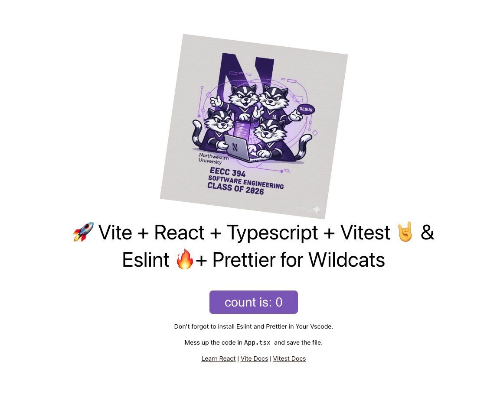

## CS394 2026 Tribe Starter

This repository is the starting point for the second (multi-team) client project in Northwestern CS394. It combines two things:

1. **A Vite + React + TypeScript app template** — the working codebase your tribe will build on.
2. **A docs-driven agent harness** — a structured `docs/` folder that coordinates both humans and AI coding agents across the tribe.

### Using this repo

The best way to use this is to use the "Use this template" button or use a tool like degit. To use degit:

```bash
npx degit https://github.com/toddwseattle/tribe-starter#main your-repo-name
```

### What's in `docs/`

| Folder                               | Primary reader                     | Purpose                                                             |
| ------------------------------------ | ---------------------------------- | ------------------------------------------------------------------- |
| [`docs/tribe/`](docs/tribe/)         | Humans                             | Team practices, client info, branching/naming conventions, backlog  |
| [`docs/agent/`](docs/agent/)         | Coding agents (and curious humans) | Architecture, design, testing, data model, story specs, ADRs        |
| [`docs/harness.md`](docs/harness.md) | Everyone                           | Registry of every feedforward guide and feedback sensor in the repo |

**Rule of thumb:** if its primary reader is a person navigating the project, it goes in `docs/tribe/`. If its primary reader is a model doing a task, it goes in `docs/agent/`. When in doubt, ask the working group that owns development practices.

### Agent entry points

- **[AGENTS.md](AGENTS.md)** — canonical brief for any AI coding agent. Read this before doing anything else.
- **[CLAUDE.md](CLAUDE.md)** — Claude Code-specific behavior layered on top of the agent brief.
- **[copilot-instructions.md](copilot-instructions.md)** — GitHub Copilot-specific instructions and tips.

### Getting started with this template

1. Fill in the `ALL_CAPS` placeholders in `docs/tribe/`, `docs/agent/`, `AGENTS.md`, and `CLAUDE.md`. Run `grep -r '[A-Z_]\{4,\}' docs/ AGENTS.md CLAUDE.md` to find them all.
2. Read [`docs/harness.md`](docs/harness.md) to understand what guides and sensors the template provides.
3. Form working groups, assign ownership, and start your Iteration 0 spike.

---

# Vite + React + TypeScript Template (2026)

The app template targets the 2026 major-version baseline verified in this repository on March 24, 2026.



## Toolchain Baseline

- Node.js `22+` recommended
- npm `10+`
- React `19.2.x`
- TypeScript `5.9.x`
- ESLint `9.39.x`
- Vite `8.0.x`
- Vitest `4.1.x`

More: [Vite](https://vitejs.dev) · [React](https://reactjs.org/) · [TypeScript](https://www.typescriptlang.org/) · [ESLint](https://eslint.org/) · [Prettier](https://prettier.io/) · [Vitest](https://vitest.dev/) · [React Testing Library](https://testing-library.com/docs/react-testing-library/intro/)

## Scripts

- `npm run dev` — start the Vite dev server
- `npm run build` — TypeScript compile + production build
- `npm run type-check` — TypeScript compiler without emitting files
- `npm run lint` — Prettier + ESLint across the repo
- `npm test` — Vitest in watch mode
- `npm test -- --run` — Vitest suite once, no watch
- `npm run test:ui` — Vitest visual UI (pinned to `127.0.0.1:51204`)
- `npm run test:coverage` — Vitest with V8 coverage report

## Testing

This template uses [Vitest](https://vitest.dev/) with [React Testing Library](https://testing-library.com/docs/react-testing-library/intro/).

**Note:** `npm audit` currently reports GHSA-rf6f-7fwh-wjgh via `flatted`; awaiting an upstream fix in `@vitest/ui` / `flat-cache`. This is a dev-only dependency — do not include `npm audit` of dev dependencies in your CI workflow until this is resolved.

Tests live alongside source files (e.g., `src/app.test.tsx` tests `src/App.tsx`).

**Common queries (priority order):**

1. `getByRole` — preferred; encourages accessible markup
2. `getByLabelText`
3. `getByPlaceholderText`
4. `getByText`
5. `getByAltText`

**Test environment** (configured in `vite.config.ts`): jsdom, globals enabled, setup file at `src/test/setup.ts`, V8 coverage with 70% thresholds.

## VS Code Setup

1. Install the ESLint and Prettier extensions.
2. Enable `formatOnSave`.
3. Open a `.tsx` file and confirm both are active.

## Pre-commit Hook

Husky runs `npm run lint` on every commit via lint-staged. Running `npm run lint` manually before committing is still the safest way to catch formatting issues early.

## Acknowledgments

This template builds on earlier starter work from [theSwordBreaker](https://github.com/TheSwordBreaker/vite-reactts-eslint-prettier) and the React/Vitest teaching materials used in Northwestern CS394.
